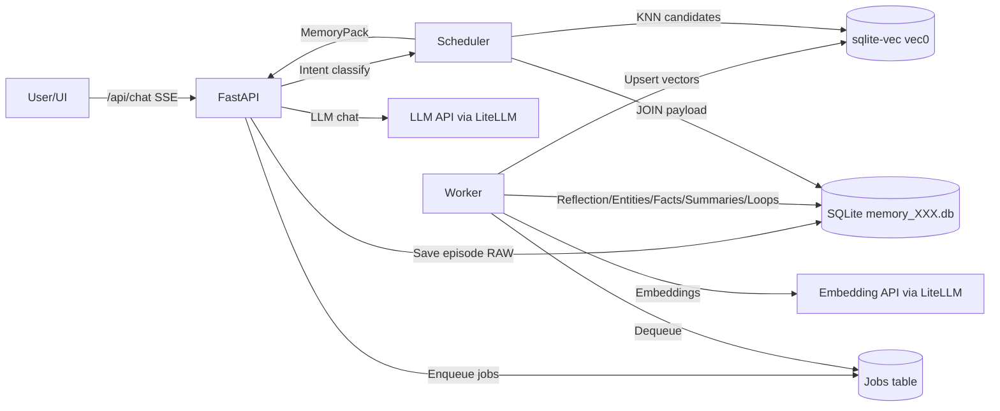
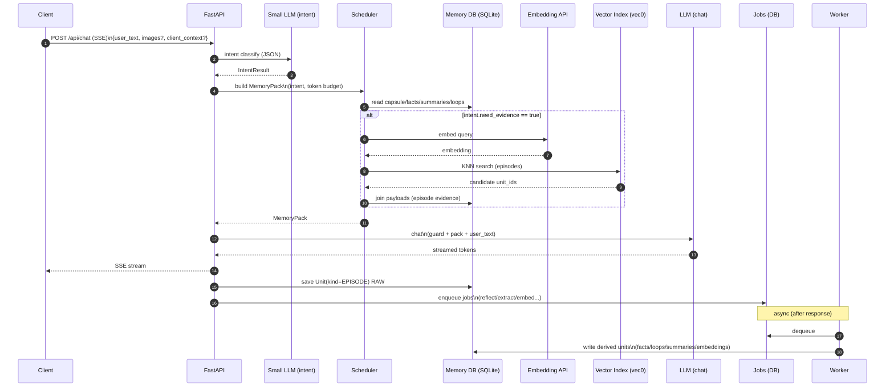
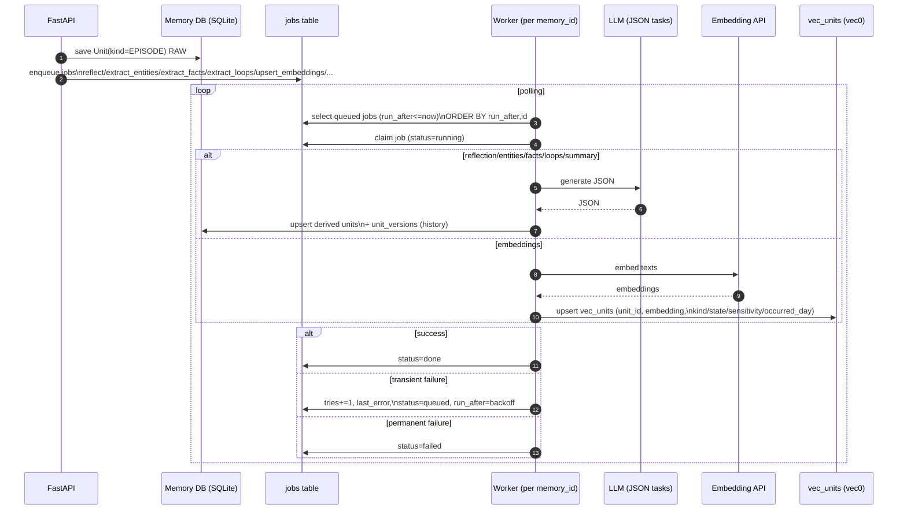
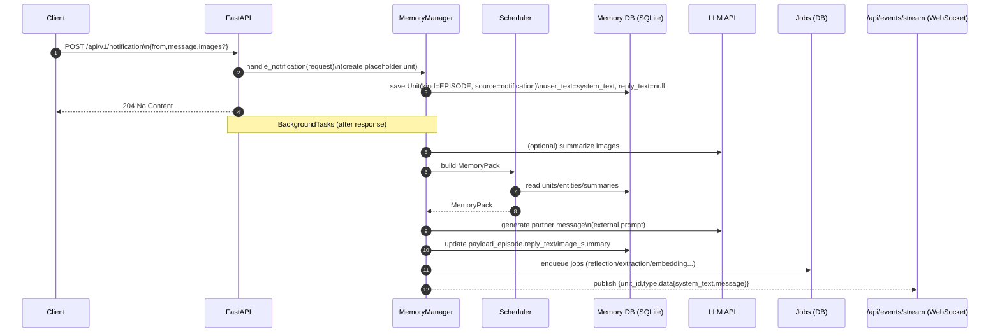
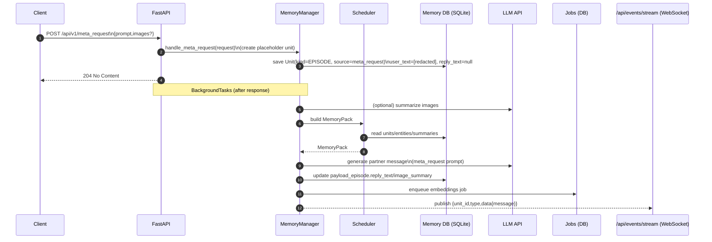

# アーキテクチャ

## コンポーネント

- **API Server（FastAPI）**
  - `/api/chat`（SSE）
  - `/api/v1/notification`
  - `/api/v1/meta_request`
  - 管理API（メモリ閲覧・編集・ピン留め等）
- **Memory Store（SQLite: `memory_<memory_id>.db`）**
  - `units` + `payload_*` による Unit化
  - 版管理（`unit_versions`）と来歴/信頼度を保持
- **Vector Index（sqlite-vec / vec0）**
  - `vec_units` は「索引」（`unit_id` と `embedding`）のみ保持
  - kind partition と metadata filtering を活用（sqlite-vec v0.1.6+）
- **Scheduler（取得計画器）**
  - 検索結果の生注入ではなく、**MemoryPack** を編成して注入
  - 意図（intent）と注入予算（token budget）で階層的に収集・圧縮
- **Worker（非同期ジョブ）**
  - Reflection / Entities / Facts / Summaries / Loops / Embedding upsert を担当
  - APIプロセスと分離（推奨）

## データフロー

## 同期/非同期の責務分離

### 同期（/api/chat のSSE中にやること）

- （任意）画像要約（Vision）
- Schedulerで **MemoryPack** を生成（主に既存DBの参照）
- `guard_prompt + memorypack + user_text` をLLMへ注入（MemoryPack内に persona/contract を含む）
- 返答をSSEで配信
- `units(kind=EPISODE)` + `payload_episode` を **RAW** で保存
- Worker用ジョブを enqueue（reflection/extraction/embedding等）

#### Intent分類（同期・軽量）

Intent分類は「何をどれだけ注入するか（取得計画）」を毎ターン切り替えるために使う。

- `intent.need_evidence=true` のときだけ Episode のKNN検索を行い、`[EPISODE_EVIDENCE]` を組み込む（それ以外は省略してレイテンシ/コストを抑える）
- `intent.need_loops` / `intent.suggest_summary_scope` で `[OPEN_LOOPS]` / `[SHARED_NARRATIVE]` の注入方針を切り替える
- `intent.sensitivity_max` で、同期で参照・注入できる機微度の上限を制御する

### 非同期（Workerがやること）

- Reflection（感情・トピック・salience/confidenceの更新）
- Entity抽出・名寄せ（`entities` / `unit_entities` / `edges`）
- Fact抽出（`units(kind=FACT)` + `payload_fact`、証拠リンクを保存）
- OpenLoop抽出（`units(kind=LOOP)` + `payload_loop`）
- Summary生成（週次/人物/トピック/関係性）
- Embedding生成と `vec_units` upsert（種別ごとに方針を決める）

#### Workerの責務（もう少し詳しく）

- **入力は「episode（RAW）」と jobs キュー**：APIが `units(kind=EPISODE)` をRAW保存し、必要な派生ジョブ（reflection/entity/fact/loop/summary/embedding等）を `jobs` にenqueueする
- **派生物はすべてUnitとして永続化**：facts/summaries/loops/entities/edges/vec_units など、後段のSchedulerが参照する「注入材料」を増やす
- **冪等（再実行可能）を前提に設計**：同じ `unit_id` に対する同種ジョブは何度走っても整合が崩れないよう upsert + 版管理で扱う
- **失敗はリトライ**：一時的なLLM失敗や拡張ロード失敗でも、`tries` と `run_after` を使ってバックオフし、上限回数で `failed` に落とす
- **DB境界**：Workerは `memory_<memory_id>.db` を対象に動作し、原則「1DB=1 Workerプロセス」でジョブキューを直列に捌く

## ストレージ境界

- 設定は `settings.db`
  - token / active preset / persona・contract / 注入予算 等
- 記憶は `memory_<memory_id>.db`
  - `units` + `payload_*` + `entities` 等
  - `vec_units`（sqlite-vec 仮想テーブル）

## `/api/v1/notification` の処理シーケンス

## `/api/v1/meta_request` の処理シーケンス

