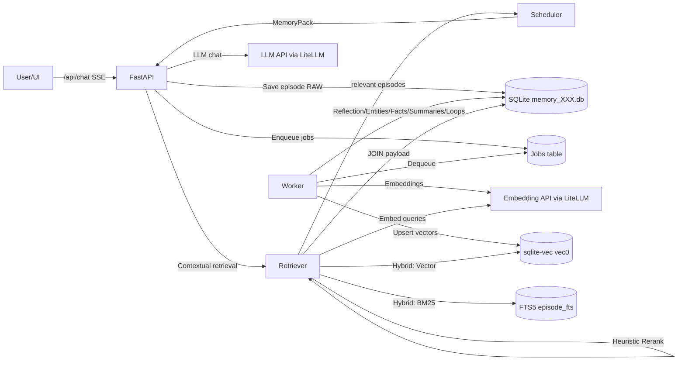
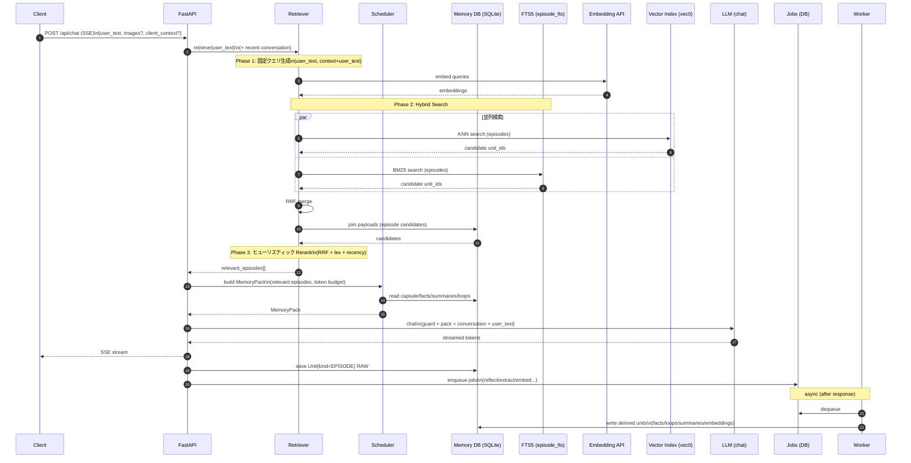
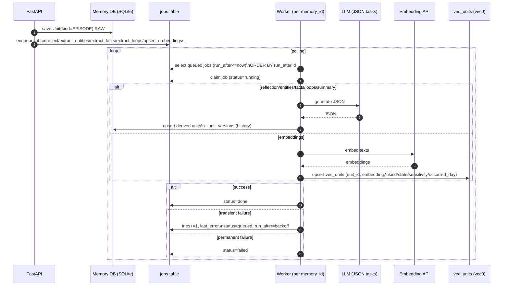
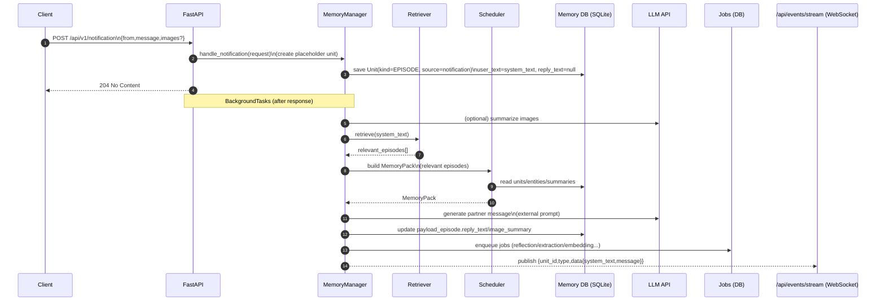
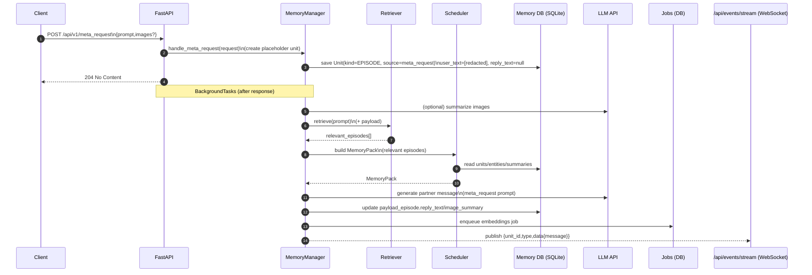

# アーキテクチャ

## コンポーネント

- **API Server（FastAPI）**
  - `/api/chat`（SSE）
  - `/api/v1/notification`
  - `/api/v1/meta_request`
  - 管理API（メモリ閲覧・編集・ピン留め等）
- **Memory Store（SQLite: `memory_<memory_id>.db`）**
  - `units` + `payload_*` による Unit化
  - 版管理（`unit_versions`）と来歴/信頼度を保持
- **Vector Index（sqlite-vec / vec0）**
  - `vec_units` は「索引」（`unit_id` と `embedding`）のみ保持
  - kind partition と metadata filtering を活用（sqlite-vec v0.1.6+）
- **Retriever（文脈考慮型記憶検索）**
  - 固定クエリ → Hybrid Search（Vector + BM25）→ ヒューリスティック Rerank の3段階で、関連する過去エピソードを高速に選別する
  - **LLMレス**: Query Expansion / LLM Reranking は廃止し、軽量・高速に動作
  - 仕様: `docs/retrieval.md`
- **Scheduler（取得計画器）**
  - 検索結果の生注入ではなく、**MemoryPack** を編成して注入
  - 注入予算（token budget）で階層的に収集・圧縮
  - Retriever の結果（relevant episodes）を `[EPISODE_EVIDENCE]` に整形して注入する
- **Worker（非同期ジョブ）**
  - Reflection / Entities / Facts / Summaries / Loops / Embedding upsert を担当
  - APIプロセスと分離（推奨）

## 実装ステータス（Current/Planned）

- Current: Episode保存後に既定ジョブ（reflect/entities/facts/loops/embeddings/capsule_refresh）をenqueue。
- Current: weekly_summary は「現週サマリが無い」または「最終更新からクールダウン経過（6h）かつ新規Episodeあり」のとき自動enqueue（重複抑制あり、管理APIからもenqueue可）。
- Current: person/topic summary は `extract_entities` 後に重要度上位（最大3件ずつ）をベストエフォートでenqueue（重複抑制あり）。
- Current: cron無し運用のため、Worker内で定期enqueue（weekly/person/topic/capsule）も実施できる（固定値: 30秒ごとに判定）。
- Current: 起動コマンドは `run.py` のみ（FastAPI起動時に内蔵Workerがバックグラウンド開始）。
- Current: SchedulerのEntity解決は alias/name の文字列一致 + 一致が無い場合のみ（短文除外あり）LLMフォールバック。
- Current: Episode注入は Scheduler が `quote_key_parts` / `summarize` / `full` に対応（現状 Retriever は `quote_key_parts` 固定）。
- Current: `/api/settings` 変更時は内蔵Workerを自動で再起動し、LLM/Embedding preset と memory_id 切替に追従する（再起動の手動運用も可能）。
- Non-goal: uvicorn multi-worker 等の多重起動は未対応（内蔵Workerが重複実行されうるため）。`workers=1` 前提で運用する。
- Planned: Lifecycle統合（矛盾管理/統合・整理）。
- Planned: Entity解決の非同期フォールバック強化（同期/非同期の最適化）。

## データフロー

## 同期/非同期の責務分離

### 同期（/api/chat のSSE中にやること）

- （任意）画像要約（Vision）
- Retrieverで文脈考慮型の記憶検索（`docs/retrieval.md`）
- Schedulerで **MemoryPack** を生成（capsule/facts/summaries/loops + relevant episodes）
- LLMへ `guard_prompt + memorypack` を system に注入し、会話履歴（max_turns_window）+ user_text を conversation として渡す（MemoryPack内に persona/contract を含む）
- 返答をSSEで配信
- `units(kind=EPISODE)` + `payload_episode` を **RAW** で保存
- Worker用ジョブを enqueue（reflection/extraction/embedding等）

#### Contextual Memory Retrieval（同期・LLMレス）

Retriever は「暗黙参照」や「会話の流れ」を取り込み、現在の会話に関連する過去エピソードを高速に選別する。

- Phase 1: 固定クエリ生成（LLMレス。user_text / context+user_text の2本）
- Phase 2: Hybrid Search（vec0 + FTS5）→ RRFマージ
- Phase 3: ヒューリスティック Rerank（LLMレス。RRF + 文字n-gram類似度 + recency で軽量スコアリング）
- Scheduler は relevant episodes を受け取り、ルール（例: high>=1 or medium>=2）と予算で `[EPISODE_EVIDENCE]` を注入する（満たさない場合は省略）

### 非同期（Workerがやること）

- Reflection（感情・トピック・salience/confidenceの更新）
- Entity抽出・名寄せ（`entities` / `unit_entities` / `edges`）
- Fact抽出（`units(kind=FACT)` + `payload_fact`、証拠リンクを保存）
- OpenLoop抽出（`units(kind=LOOP)` + `payload_loop`）
- Summary生成（週次/人物/トピック/関係性）
- Embedding生成と `vec_units` upsert（種別ごとに方針を決める）

#### Workerの責務（もう少し詳しく）

- **入力は「episode（RAW）」と jobs キュー**：APIが `units(kind=EPISODE)` をRAW保存し、必要な派生ジョブ（reflection/entity/fact/loop/summary/embedding等）を `jobs` にenqueueする
- **派生物はすべてUnitとして永続化**：facts/summaries/loops/entities/edges/vec_units など、後段のSchedulerが参照する「注入材料」を増やす
- **冪等（再実行可能）を前提に設計**：同じ `unit_id` に対する同種ジョブは何度走っても整合が崩れないよう upsert + 版管理で扱う
- **失敗はリトライ**：一時的なLLM失敗や拡張ロード失敗でも、`tries` と `run_after` を使ってバックオフし、上限回数で `failed` に落とす
- **DB境界**：Workerは `memory_<memory_id>.db` を対象に動作し、原則「1DB=1 Workerプロセス」でジョブキューを直列に捌く

## ストレージ境界

- 設定は `settings.db`
  - token / active preset / persona・contract / 注入予算 等
- 記憶は `memory_<memory_id>.db`
  - `units` + `payload_*` + `entities` 等
  - `vec_units`（sqlite-vec 仮想テーブル）

## `/api/v1/notification` の処理シーケンス

## `/api/v1/meta_request` の処理シーケンス

