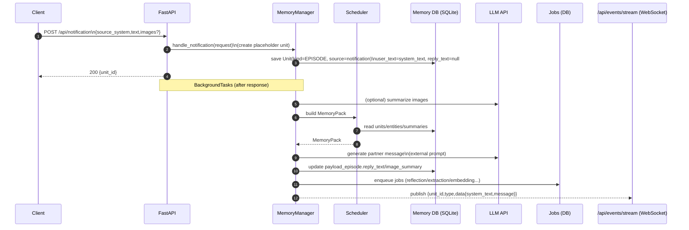
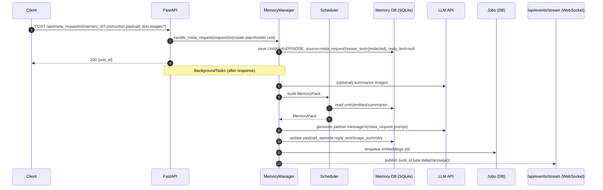

# アーキテクチャ

## コンポーネント

- **API Server（FastAPI）**
  - `/api/chat`（SSE）
  - `/api/notification`
  - `/api/meta_request`
  - 管理API（メモリ閲覧・編集・ピン留め等）
- **Memory Store（SQLite: `memory_<memory_id>.db`）**
  - `units` + `payload_*` による Unit化
  - 版管理（`unit_versions`）と来歴/信頼度を保持
- **Vector Index（sqlite-vec / vec0）**
  - `vec_units` は「索引」（`unit_id` と `embedding`）のみ保持
  - kind partition と metadata filtering を活用（sqlite-vec v0.1.6+）
- **Scheduler（取得計画器）**
  - 検索結果の生注入ではなく、**MemoryPack** を編成して注入
  - 意図（intent）と注入予算（token budget）で階層的に収集・圧縮
- **Worker（非同期ジョブ）**
  - Reflection / Entities / Facts / Summaries / Loops / Embedding upsert を担当
  - APIプロセスと分離（推奨）

## データフロー

```mermaid
flowchart LR
  U[User/UI] -->|/api/chat SSE| API[FastAPI]
  API -->|Intent classify| SCH[Scheduler]
  SCH -->|MemoryPack| API
  API -->|LLM chat| LLM[LLM API via LiteLLM]
  API -->|Save episode (raw)| DB[(SQLite memory_<id>.db)]
  API -->|Enqueue jobs| Q[(Jobs table)]
  W[Worker] -->|Dequeue| Q
  W -->|Reflection/Entities/Facts/Summaries/Loops| DB
  W -->|Embeddings| EMB[Embedding API via LiteLLM]
  W -->|Upsert vectors| VEC[(sqlite-vec vec0)]
  SCH -->|KNN candidates| VEC
  SCH -->|JOIN payload| DB
```

## 同期/非同期の責務分離

### 同期（/api/chat のSSE中にやること）

- （任意）画像要約（Vision）
- Schedulerで **MemoryPack** を生成（主に既存DBの参照）
- `guard_prompt + memorypack + user_text` をLLMへ注入（MemoryPack内に persona/contract を含む）
- 返答をSSEで配信
- `units(kind=EPISODE)` + `payload_episode` を **RAW** で保存
- Worker用ジョブを enqueue（reflection/extraction/embedding等）

### 非同期（Workerがやること）

- Reflection（感情・トピック・salience/confidenceの更新）
- Entity抽出・名寄せ（`entities` / `unit_entities` / `edges`）
- Fact抽出（`units(kind=FACT)` + `payload_fact`、証拠リンクを保存）
- OpenLoop抽出（`units(kind=LOOP)` + `payload_loop`）
- Summary生成（週次/人物/トピック/関係性）
- Embedding生成と `vec_units` upsert（種別ごとに方針を決める）

## ストレージ境界

- 設定は `settings.db`
  - token / active preset / persona・contract / 注入予算 等
- 記憶は `memory_<memory_id>.db`
  - `units` + `payload_*` + `entities` 等
  - `vec_units`（sqlite-vec 仮想テーブル）


## `/api/notification` の処理シーケンス



## `/api/meta_request` の処理シーケンス


