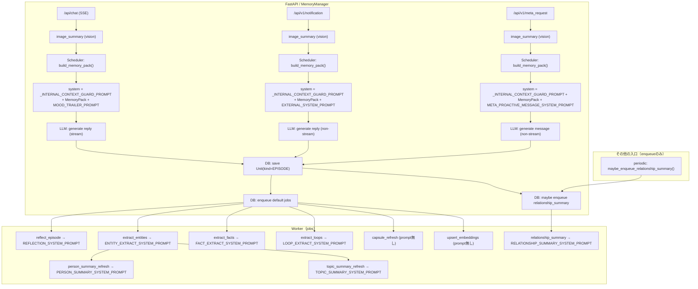
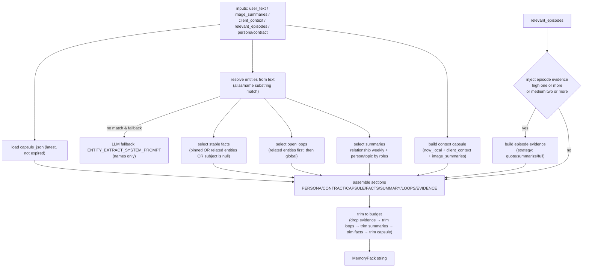
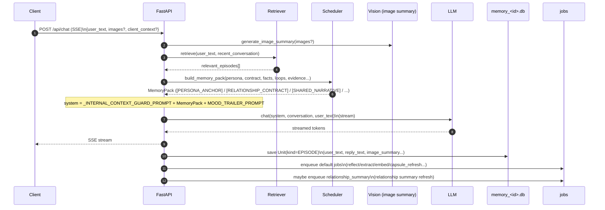
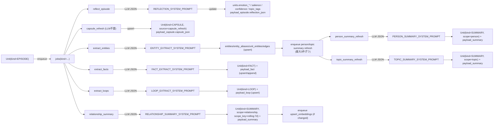

# プロンプト使用箇所マップ（どこで何が使われるか）

このドキュメントは、LLMに渡す各種プロンプト（`cocoro_ghost/prompts.py` + 主要なインラインプロンプト + コード内の固定ガード）と、それが **どの処理フローで・どのタイミングで・どの入力で** 使われるかを図で整理したものです。

> JSONスキーマそのものは `docs/prompts.md`（Reflection/Entity/Fact/Loop/Summary など）を参照してください。

## 1) プロンプト一覧（カタログ）

| Prompt ID | 定義元 | 主な用途 | 呼び出し元（代表） | 同期/非同期 |
|---|---|---|---|---|
| `REFLECTION_SYSTEM_PROMPT` | `cocoro_ghost/prompts.py` | エピソードから内的メモ（感情/話題/重要度）をJSON抽出 | `cocoro_ghost/worker.py::_handle_reflect_episode`（+ `cocoro_ghost/reflection.py::generate_reflection`） | 非同期（Worker Job） |
| `ENTITY_EXTRACT_SYSTEM_PROMPT` | `cocoro_ghost/prompts.py` | 固有名と関係（任意）をJSON抽出 | `cocoro_ghost/worker.py::_handle_extract_entities` / `cocoro_ghost/scheduler.py::_extract_entity_names_with_llm` | 非同期（Worker Job）/ 同期（MemoryPack補助） |
| `FACT_EXTRACT_SYSTEM_PROMPT` | `cocoro_ghost/prompts.py` | 長期保持すべき安定知識（facts）をJSON抽出 | `cocoro_ghost/worker.py::_handle_extract_facts` | 非同期（Worker Job） |
| `LOOP_EXTRACT_SYSTEM_PROMPT` | `cocoro_ghost/prompts.py` | 未完了事項（open loops）をJSON抽出 | `cocoro_ghost/worker.py::_handle_extract_loops` | 非同期（Worker Job） |
| `PERSON_SUMMARY_SYSTEM_PROMPT` | `cocoro_ghost/prompts.py` | 人物の会話注入用サマリをJSON生成 | `cocoro_ghost/worker.py::_handle_person_summary_refresh` | 非同期（Worker Job） |
| `TOPIC_SUMMARY_SYSTEM_PROMPT` | `cocoro_ghost/prompts.py` | トピックの会話注入用サマリをJSON生成 | `cocoro_ghost/worker.py::_handle_topic_summary_refresh` | 非同期（Worker Job） |
| `RELATIONSHIP_SUMMARY_SYSTEM_PROMPT` | `cocoro_ghost/prompts.py` | 関係性サマリ（SharedNarrative/relationship, rolling:7d）をJSON生成 | `cocoro_ghost/worker.py::_handle_relationship_summary`（enqueue: `cocoro_ghost/memory.py::MemoryManager::_maybe_enqueue_relationship_summary` / `cocoro_ghost/periodic.py::maybe_enqueue_relationship_summary`） | 非同期（Worker Job） |
| `EXTERNAL_SYSTEM_PROMPT` | `cocoro_ghost/prompts.py` | 通知（notification）から“自然な返答文”を生成 | `cocoro_ghost/memory.py::MemoryManager::_process_notification_async` | 同期風（API応答後のBackgroundTasks） |
| `META_PROACTIVE_MESSAGE_SYSTEM_PROMPT` | `cocoro_ghost/prompts.py` | meta_request（指示+材料）から能動メッセージ生成 | `cocoro_ghost/memory.py::MemoryManager::_process_meta_request_async` | 同期風（API応答後のBackgroundTasks） |
| `DEFAULT_PERSONA_ANCHOR` | `cocoro_ghost/prompts.py` | PersonaPreset の初期値（未設定時の雛形） | `cocoro_ghost/db.py`（settings初期化） | 起動時/初期化 |
| `DEFAULT_RELATIONSHIP_CONTRACT` | `cocoro_ghost/prompts.py` | ContractPreset の初期値（安全/距離感） | `cocoro_ghost/db.py`（settings初期化） | 起動時/初期化 |
| `_INTERNAL_CONTEXT_GUARD_PROMPT` | `cocoro_ghost/memory.py` | “内部注入（MemoryPack）をユーザーに漏らさない”固定ガード | `cocoro_ghost/memory.py::MemoryManager`（chat/notification/meta_request） | 同期（system prompt先頭に常に付与） |
| `MOOD_TRAILER_PROMPT`（inline） | `cocoro_ghost/memory.py` | chatの返答末尾に「内部JSON（感情/重要度/方針ノブ）」を付加し、SSEから除外して保存（即時反映） | `cocoro_ghost/memory.py::MemoryManager.stream_chat` | 同期（chat） |
| `IMAGE_SUMMARY_PROMPT`（inline） | `cocoro_ghost/llm_client.py` | 画像を短い日本語で要約（vision） | `cocoro_ghost/llm_client.py::LlmClient.generate_image_summary`（呼び出し: `cocoro_ghost/memory.py::MemoryManager::_summarize_images` / `cocoro_ghost/memory.py::MemoryManager.handle_capture`） | 同期（chat/capture）/ 同期風（notification/meta_request の BackgroundTasks） |

補足:
- Capsule（短期状態）は **プロンプトではなく**、Workerジョブ `capsule_refresh`（LLM不要）で更新されます（`cocoro_ghost/worker.py::_handle_capsule_refresh`）。

## 2) 全体フロー：どの入口でどのプロンプトが使われるか

## 2.1) `build_memory_pack()` の中身（MemoryPackをどう組み立てるか）

`build_memory_pack()` は「LLMに注入する内部コンテキスト」を、入力（ユーザー発話/画像/クライアント状況/検索結果）から **セクション単位で組み立て**、最後に **文字数予算（token近似）内に収める** 関数です（`cocoro_ghost/scheduler.py::build_memory_pack`）。

### 入力

- `persona_text` / `contract_text`: settings の現在値（未設定なら空）
- `user_text`: 今回のユーザー発話
- `image_summaries`: 今回の画像要約（vision の結果）
- `client_context`: `active_app` / `window_title` / `locale` など（任意）
- `relevant_episodes`: Retriever が返した関連エピソード（rank済み + reason付き）
- `max_inject_tokens`: 注入予算（内部では `max_chars = max_inject_tokens * 4` に近似）
- `llm_client` + `entity_fallback`: Entity文字列一致で取れない場合のLLMフォールバック用（任意）

### 生成手順（概略）

### セクション別の中身（実際に入るもの）

- `[PERSONA_ANCHOR]`: `persona_text`（空ならセクションだけ残す）
- `[RELATIONSHIP_CONTRACT]`: `contract_text`（空ならセクションだけ残す）
- `[CONTEXT_CAPSULE]`:
  - DBの `capsule_json`（最新かつ未expireがあれば先頭に1つ）
  - `now_local: <ISO8601>`
  - `active_app` / `window_title` / `locale`（あれば）
  - `[ユーザーが今送った画像の内容] <image_summary>`（今回の画像ぶん）
- `[STABLE_FACTS]`:
  - 対象: `Unit(kind=FACT)`（最大12件）
  - 絞り込み（entity が取れている場合）: `pin=1` または subject/object がその entity に関連、または subject が `null` のもの
  - 絞り込み（entity が取れない場合）: 直近200件 + pin=1 を混ぜてからスコアで上位
  - スコア: `confidence/salience/recency/pin` を合成して降順
  - 形式: `- SUBJECT predicate OBJECT`（entity_idが引けると名前に置換、subject未指定は `USER`）
- `[SHARED_NARRATIVE]`:
  - `scope_key=rolling:7d` の relationship summary（無ければ latest をfallback）
  - 今回マッチした entity に応じて追加:
    - roles に `person` を含む: `scope_label=person, scope_key=person:<entity_id>`
    - roles に `topic` を含む: `scope_label=topic, scope_key=topic:<normalized-or-name-lower>`
- `[OPEN_LOOPS]`:
  - 対象: `Unit(kind=LOOP, status=open)`（最大8件）
  - entity が取れている場合: まず entity 関連（`unit_entities` 経由）を優先し、足りなければ全体から補充
- `[EPISODE_EVIDENCE]`:
  - `should_inject_episodes()` が True のときだけ注入（`high>=1` or `medium>=2`）
  - `injection_strategy`:
    - `quote_key_parts`（既定）: user/reply を短く引用
    - `summarize`: 1行「要点: ...」に寄せる
    - `full`: 長めに引用
  - 各項目に `→ 関連: <reason>` を添える

### 予算超過時の削り順（優先度）

1. `[EPISODE_EVIDENCE]` を丸ごと落とす
2. `[OPEN_LOOPS]` を末尾から減らす
3. `[SHARED_NARRATIVE]` を1件に絞り、まだ超過なら本文を短縮
4. `[STABLE_FACTS]` を末尾から減らす
5. `[CONTEXT_CAPSULE]` を末尾から減らす（最後の手段）

補足:
- `build_memory_pack()` は一旦 `Sensitivity.SECRET` までを注入対象として扱います（`sensitivity_max=SECRET`）。
- Entity の LLM フォールバックは「一致が0件」かつ「短文（正規化後8文字未満）ではない」ときだけ実行します（ノイズ回避）。

## 3) 同期フロー（chat）：MemoryPack と “ガード” の位置づけ

`/api/chat` では、ユーザー編集可能な `persona/contract` を **MemoryPackの先頭セクション**として注入しつつ、コード側の固定ガード（秘匿/安全）を system の一番先頭に付けています。

## 4) 非同期フロー（Worker jobs）：派生物ごとに使うプロンプト

## 5) “どの入力で” 各プロンプトが呼ばれるか（要点）

- Reflection / Entities / Facts / Loops: `payload_episode` の `user_text/reply_text/image_summary` を連結して入力にする（`cocoro_ghost/worker.py`）。
- Relationship summary（rolling:7d）: 直近7日程度の `Unit(kind=EPISODE)` を時系列で最大200件抜粋し、`range_start/range_end` + 箇条書き（unit_id + user/reply抜粋）として入力にする（`cocoro_ghost/worker.py::_handle_relationship_summary`）。
- Capsule refresh: 直近の `Unit(kind=EPISODE)`（既定 `limit=5`）の抜粋に加え、「重要度×時間減衰」で集約した `partner_mood` を `payload_capsule.capsule_json` に更新する（`cocoro_ghost/worker.py::_handle_capsule_refresh` / `cocoro_ghost/mood.py`）。
- Notification: `# notification ...` 形式に整形したテキスト（+ 画像要約）を `conversation=[{"role":"user","content":...}]` として渡す（`cocoro_ghost/memory.py`）。
- Meta request: `# meta_request ...` 形式に整形したテキスト（instruction + payload + 画像要約）を渡す（`cocoro_ghost/memory.py`）。
- Persona/Contract: settings の active preset から読み込まれ、Schedulerが `[PERSONA_ANCHOR]` / `[RELATIONSHIP_CONTRACT]` として MemoryPack に注入する（`cocoro_ghost/config.py` / `cocoro_ghost/scheduler.py`）。
- 内部ガード: chat/notification/meta_request の system 先頭に固定で付与される（`cocoro_ghost/memory.py::_INTERNAL_CONTEXT_GUARD_PROMPT`）。
- Mood trailer（chatのみ）: 返答本文の末尾に区切り文字 `<<<COCORO_GHOST_INTERNAL_JSON_v1>>>` + 内部JSON（Reflection互換 + `partner_policy`）を付加する。サーバ側は区切り以降をSSEに流さず回収し、`units.emotion_* / salience / confidence / topic_tags` と `payload_episode.reflection_json` に即時反映する（`cocoro_ghost/memory.py`）。これにより「その発言で怒る」を同ターンで実現しつつ、Workerの `reflect_episode` は冪等にスキップ可能になる。
- Person summary: `person_summary_refresh` は注入用の `summary_text` に加えて、`liking_score`（パートナーAI→人物の好感度 0..1）を `summary_json` に保存する。Schedulerは現状 `summary_text` を注入するため、好感度は `summary_text` 先頭に1行で含める運用（`cocoro_ghost/worker.py::_handle_person_summary_refresh`）。
- 画像要約（vision）: `images[].base64` を画像として渡し、「短い日本語で要約」したテキストを得る（`cocoro_ghost/llm_client.py::LlmClient.generate_image_summary`）。chat/notification/meta_request/capture の `payload_episode.image_summary` に保存される。

## 6) 例外：Scheduler内での Entity 抽出（LLMフォールバック）

MemoryPack の fact/summaries を「今の話題（entity）に寄せる」ため、文字列一致で entity が取れないときだけ、Schedulerが `ENTITY_EXTRACT_SYSTEM_PROMPT` を使って **候補名だけ** 抽出するフォールバックがあります（`cocoro_ghost/scheduler.py::_extract_entity_names_with_llm`）。
