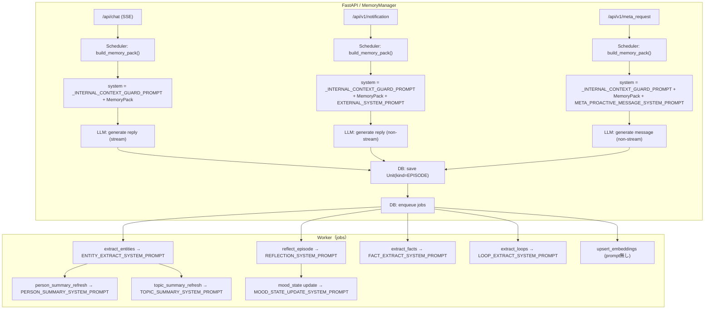
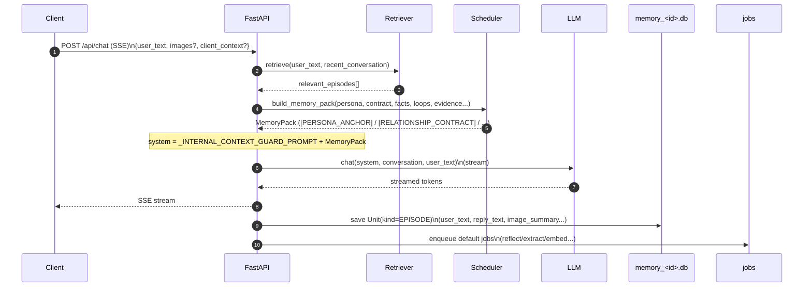
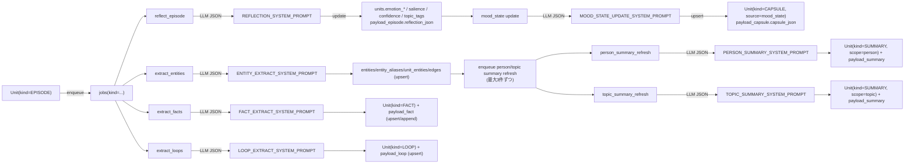

# プロンプト使用箇所マップ（どこで何が使われるか）

このドキュメントは、`cocoro_ghost/prompts.py` の各プロンプト（+ コード内の固定ガード）と、それが **どの処理フローで・どのタイミングで・どの入力で** 使われるかを図で整理したものです。

> JSONスキーマそのものは `docs/prompts.md`（Reflection/Entity/Fact/Loop/Summary など）を参照してください。

## 1) プロンプト一覧（カタログ）

| Prompt ID | 定義元 | 主な用途 | 呼び出し元（代表） | 同期/非同期 |
|---|---|---|---|---|
| `REFLECTION_SYSTEM_PROMPT` | `cocoro_ghost/prompts.py` | エピソードから内的メモ（感情/話題/重要度）をJSON抽出 | `cocoro_ghost/worker.py::_handle_reflect_episode`（+ `cocoro_ghost/reflection.py::generate_reflection`） | 非同期（Worker Job） |
| `MOOD_STATE_UPDATE_SYSTEM_PROMPT` | `cocoro_ghost/prompts.py` | 直近の流れを踏まえた “機嫌/印象” Capsule をJSON更新 | `cocoro_ghost/worker.py::_update_mood_state_from_episode` | 非同期（Worker Job） |
| `ENTITY_EXTRACT_SYSTEM_PROMPT` | `cocoro_ghost/prompts.py` | 固有名と関係（任意）をJSON抽出 | `cocoro_ghost/worker.py::_handle_extract_entities` / `cocoro_ghost/scheduler.py::_extract_entity_names_with_llm` | 非同期（Worker Job）/ 同期（MemoryPack補助） |
| `FACT_EXTRACT_SYSTEM_PROMPT` | `cocoro_ghost/prompts.py` | 長期保持すべき安定知識（facts）をJSON抽出 | `cocoro_ghost/worker.py::_handle_extract_facts` | 非同期（Worker Job） |
| `LOOP_EXTRACT_SYSTEM_PROMPT` | `cocoro_ghost/prompts.py` | 未完了事項（open loops）をJSON抽出 | `cocoro_ghost/worker.py::_handle_extract_loops` | 非同期（Worker Job） |
| `PERSON_SUMMARY_SYSTEM_PROMPT` | `cocoro_ghost/prompts.py` | 人物の会話注入用サマリをJSON生成 | `cocoro_ghost/worker.py::_handle_person_summary_refresh` | 非同期（Worker Job） |
| `TOPIC_SUMMARY_SYSTEM_PROMPT` | `cocoro_ghost/prompts.py` | トピックの会話注入用サマリをJSON生成 | `cocoro_ghost/worker.py::_handle_topic_summary_refresh` | 非同期（Worker Job） |
| `EXTERNAL_SYSTEM_PROMPT` | `cocoro_ghost/prompts.py` | 通知（notification）から“自然な返答文”を生成 | `cocoro_ghost/memory.py::MemoryManager::_process_notification_async` | 同期風（API応答後のBackgroundTasks） |
| `META_PROACTIVE_MESSAGE_SYSTEM_PROMPT` | `cocoro_ghost/prompts.py` | meta_request（指示+材料）から能動メッセージ生成 | `cocoro_ghost/memory.py::MemoryManager::_process_meta_request_async` | 同期風（API応答後のBackgroundTasks） |
| `DEFAULT_PERSONA_ANCHOR` | `cocoro_ghost/prompts.py` | PersonaPreset の初期値（未設定時の雛形） | `cocoro_ghost/db.py`（settings初期化） | 起動時/初期化 |
| `DEFAULT_RELATIONSHIP_CONTRACT` | `cocoro_ghost/prompts.py` | ContractPreset の初期値（安全/距離感） | `cocoro_ghost/db.py`（settings初期化） | 起動時/初期化 |
| `_INTERNAL_CONTEXT_GUARD_PROMPT` | `cocoro_ghost/memory.py` | “内部注入（MemoryPack）をユーザーに漏らさない”固定ガード | `cocoro_ghost/memory.py::MemoryManager`（chat/notification/meta_request） | 同期（system prompt先頭に常に付与） |

## 2) 全体フロー：どの入口でどのプロンプトが使われるか

## 3) 同期フロー（chat）：MemoryPack と “ガード” の位置づけ

`/api/chat` では、ユーザー編集可能な `persona/contract` を **MemoryPackの先頭セクション**として注入しつつ、コード側の固定ガード（秘匿/安全）を system の一番先頭に付けています。

## 4) 非同期フロー（Worker jobs）：派生物ごとに使うプロンプト

## 5) “どの入力で” 各プロンプトが呼ばれるか（要点）

- Reflection / Entities / Facts / Loops: `payload_episode` の `user_text/reply_text/image_summary` を連結して入力にする（`cocoro_ghost/worker.py`）。
- Mood state update: `previous_mood_state_json`（既存Capsule）と、episode+reflection を束ねたJSONを入力にする（`cocoro_ghost/worker.py::_update_mood_state_from_episode`）。
- Notification: `# notification ...` 形式に整形したテキスト（+ 画像要約）を `conversation=[{"role":"user","content":...}]` として渡す（`cocoro_ghost/memory.py`）。
- Meta request: `# meta_request ...` 形式に整形したテキスト（instruction + payload + 画像要約）を渡す（`cocoro_ghost/memory.py`）。
- Persona/Contract: settings の active preset から読み込まれ、Schedulerが `[PERSONA_ANCHOR]` / `[RELATIONSHIP_CONTRACT]` として MemoryPack に注入する（`cocoro_ghost/config.py` / `cocoro_ghost/scheduler.py`）。
- 内部ガード: chat/notification/meta_request の system 先頭に固定で付与される（`cocoro_ghost/memory.py::_INTERNAL_CONTEXT_GUARD_PROMPT`）。

## 6) 例外：Scheduler内での Entity 抽出（LLMフォールバック）

MemoryPack の fact/summaries を「今の話題（entity）に寄せる」ため、文字列一致で entity が取れないときだけ、Schedulerが `ENTITY_EXTRACT_SYSTEM_PROMPT` を使って **候補名だけ** 抽出するフォールバックがあります（`cocoro_ghost/scheduler.py::_extract_entity_names_with_llm`）。
