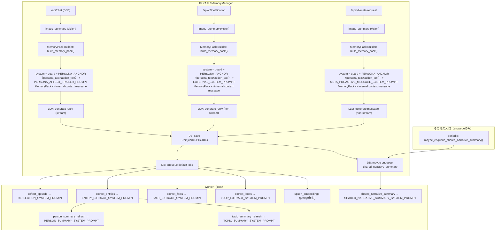
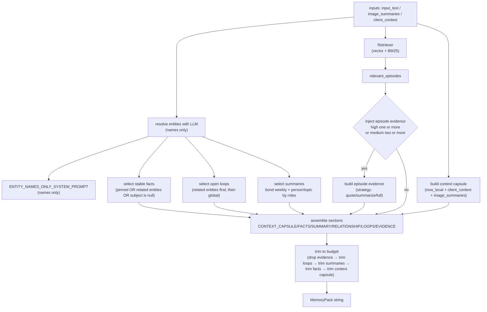
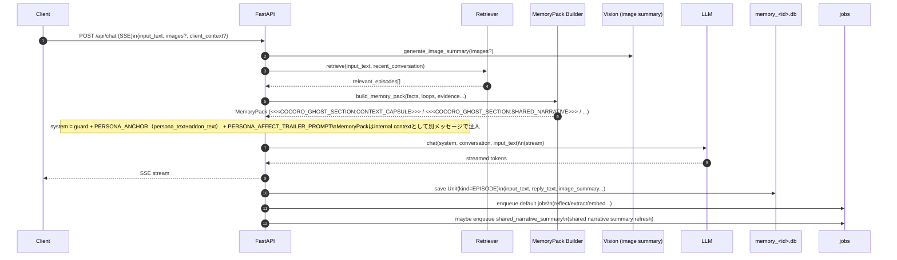
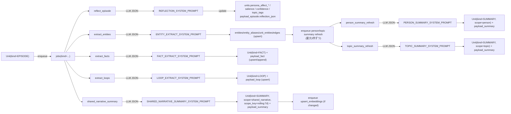

# プロンプト使用箇所マップ（どこで何が使われるか）

このドキュメントは、LLMに渡す各種プロンプト（`cocoro_ghost/prompts.py` + 主要なインラインプロンプト）と、それが **どの処理フローで・どのタイミングで・どの入力で** 使われるかを図で整理したものです。

> JSONスキーマそのものは `docs/prompts.md`（Reflection/Entity/Fact/Loop/Summary など）を参照してください。

## 1) プロンプト一覧（カタログ）

| Prompt ID | 定義元 | 主な用途 | 呼び出し元（代表） | 同期/非同期 |
|---|---|---|---|---|
| `REFLECTION_SYSTEM_PROMPT` | `cocoro_ghost/prompts.py` | エピソードから内的メモ（感情/話題/重要度）をJSON抽出 | `cocoro_ghost/worker.py::_handle_reflect_episode` | 非同期（Worker Job） |
| `ENTITY_EXTRACT_SYSTEM_PROMPT` | `cocoro_ghost/prompts.py` | 固有名と関係（任意）をJSON抽出 | `cocoro_ghost/worker.py::_handle_extract_entities` | 非同期（Worker Job） |
| `ENTITY_NAMES_ONLY_SYSTEM_PROMPT` | `cocoro_ghost/prompts.py` | MemoryPack補助: entity名だけをJSON抽出（names only） | `cocoro_ghost/memory.py`（前処理: `extract_entity_names_with_llm`） | 同期（MemoryPack補助） |
| `FACT_EXTRACT_SYSTEM_PROMPT` | `cocoro_ghost/prompts.py` | 長期保持すべき安定知識（facts）をJSON抽出 | `cocoro_ghost/worker.py::_handle_extract_facts` | 非同期（Worker Job） |
| `LOOP_EXTRACT_SYSTEM_PROMPT` | `cocoro_ghost/prompts.py` | 未完了事項（open loops）をJSON抽出 | `cocoro_ghost/worker.py::_handle_extract_loops` | 非同期（Worker Job） |
| `PERSON_SUMMARY_SYSTEM_PROMPT` | `cocoro_ghost/prompts.py` | 人物の会話注入用サマリをJSON生成 | `cocoro_ghost/worker.py::_handle_person_summary_refresh` | 非同期（Worker Job） |
| `TOPIC_SUMMARY_SYSTEM_PROMPT` | `cocoro_ghost/prompts.py` | トピックの会話注入用サマリをJSON生成 | `cocoro_ghost/worker.py::_handle_topic_summary_refresh` | 非同期（Worker Job） |
| `SHARED_NARRATIVE_SUMMARY_SYSTEM_PROMPT` | `cocoro_ghost/prompts.py` | 背景共有サマリ（shared_narrative, rolling:7d）をJSON生成 | `cocoro_ghost/worker.py::_handle_shared_narrative_summary`（enqueue: `cocoro_ghost/memory.py::MemoryManager::_maybe_enqueue_shared_narrative_summary` / `cocoro_ghost/periodic.py::maybe_enqueue_shared_narrative_summary`） | 非同期（Worker Job） |
| `EXTERNAL_SYSTEM_PROMPT` | `cocoro_ghost/prompts.py` | 通知（notification）から“自然な返答文”を生成 | `cocoro_ghost/memory.py::MemoryManager::_process_notification_async` | 同期風（API応答後のBackgroundTasks） |
| `META_PROACTIVE_MESSAGE_SYSTEM_PROMPT` | `cocoro_ghost/prompts.py` | meta-request（指示+材料）から能動メッセージ生成 | `cocoro_ghost/memory.py::MemoryManager::_process_meta_request_async` | 同期風（API応答後のBackgroundTasks） |
| `DEFAULT_PERSONA_ANCHOR` | `cocoro_ghost/prompts.py` | PersonaPreset の初期値（未設定時の雛形） | `cocoro_ghost/db.py`（settings初期化） | 起動時/初期化 |
| `DEFAULT_PERSONA_ADDON` | `cocoro_ghost/prompts.py` | addon（PERSONA_ANCHORの任意追加オプション）の初期値 | `cocoro_ghost/db.py`（settings初期化） | 起動時/初期化 |
| `PERSONA_AFFECT_TRAILER_PROMPT`（inline） | `cocoro_ghost/memory.py` | chatの返答末尾に「内部JSON（反射/機嫌）」を付加し、SSEから除外して保存（即時反映） | `cocoro_ghost/memory.py::MemoryManager.stream_chat` | 同期（chat） |
| `IMAGE_SUMMARY_PROMPT`（inline） | `cocoro_ghost/llm_client.py` | 画像を短い日本語で要約（vision） | `cocoro_ghost/llm_client.py::LlmClient.generate_image_summary`（呼び出し: `cocoro_ghost/memory.py::MemoryManager::_summarize_images`） | 同期（chat）/ 同期風（notification/meta-request の BackgroundTasks） |

補足:
- `<<<COCORO_GHOST_SECTION:CONTEXT_CAPSULE>>>` はプロンプトではなく、同期処理で組み立てる「内部コンテキストのセクション」です（`cocoro_ghost/memory_pack_builder.py`）。

## 2) 全体フロー：どの入口でどのプロンプトが使われるか

## 2.1) `build_memory_pack()` の中身（MemoryPackをどう組み立てるか）

`build_memory_pack()` は「LLMに注入する内部コンテキスト」を、入力（ユーザー発話/画像/クライアント状況/検索結果）から **セクション単位で組み立て**、最後に **文字数予算（token近似）内に収める** 関数です（`cocoro_ghost/memory_pack_builder.py::build_memory_pack`）。

### 入力

- `input_text`: 今回の入力
- `image_summaries`: 今回の画像要約（vision の結果）
- `client_context`: `active_app` / `window_title` / `locale` など（任意）
- `relevant_episodes`: Retriever が返した関連エピソード（rank済み + reason付き）
- `matched_entity_ids`: LLMの names only 抽出＋alias突合で解決した entity_id 群
- `max_inject_tokens`: 注入予算（内部では `max_chars = max_inject_tokens * 4` に近似）

### 生成手順（概略）

### セクション別の中身（実際に入るもの）

- `PERSONA_ANCHOR` は system prompt 側に固定注入する（MemoryPackには含めない）
- `OUTPUT_FORMAT` は system prompt 側に固定注入する（PERSONA_ANCHORと分離し、出力フォーマット指示として明示）
- `<<<COCORO_GHOST_SECTION:CONTEXT_CAPSULE>>>`:
  - `now_local: <ISO8601>`
  - `persona_mood_state: {...}`（重要度×時間減衰で集約した機嫌。会話品質優先のためDBに保存しない）
  - `active_app` / `window_title` / `locale`（あれば）
  - `[ユーザーが今送った画像の内容] <image_summary>`（今回の画像ぶん）
- `<<<COCORO_GHOST_SECTION:STABLE_FACTS>>>`:
  - 対象: `Unit(kind=FACT)`（最大12件）
  - 絞り込み（entity が取れている場合）: `pin=1` または subject/object がその entity に関連、または subject が `null` のもの
  - 絞り込み（entity が取れない場合）: 直近200件 + pin=1 を混ぜてからスコアで上位
  - スコア: `confidence/salience/recency/pin` を合成して降順
  - 形式: `- SUBJECT predicate OBJECT`（entity_idが引けると名前に置換、subject未指定は `SPEAKER`）
- `<<<COCORO_GHOST_SECTION:SHARED_NARRATIVE>>>`:
  - 会話の「共有された物語（継続する関係性や背景）」を短く注入するセクション
  - `scope_label=shared_narrative, scope_key=rolling:7d` の 背景共有サマリ（無ければ latest をfallback）
  - 今回マッチした entity に応じて追加:
    - roles に `person` を含む: `scope_label=person, scope_key=person:<entity_id>`
    - roles に `topic` を含む: `scope_label=topic, scope_key=topic:<normalized-or-name-lower>`
- `<<<COCORO_GHOST_SECTION:RELATIONSHIP_STATE>>>`:
  - 会話に出た人物の「数値的な関係性状態」を注入するセクション
  - 対象人物: 今回の LLM 名抽出でマッチした entity のうち `roles=person` のみ
  - 参照元: 各人物の最新 `person` summary JSON の `favorability_score`
  - 形式: `- person_id=... name=... favorability_score=...`（最大5件）
- `<<<COCORO_GHOST_SECTION:OPEN_LOOPS>>>`:
  - 対象: `Unit(kind=LOOP, status=open)`（最大8件）
  - entity が取れている場合: まず entity 関連（`unit_entities` 経由）を優先し、足りなければ全体から補充
- `<<<COCORO_GHOST_SECTION:EPISODE_EVIDENCE>>>`:
  - `should_inject_episodes()` が True のときだけ注入（`high>=1` or `medium>=2`）
  - `injection_strategy`:
  - `quote_key_parts`（既定）: input/reply を短く引用
  - `summarize`: 1行「要点: ...」に寄せる
  - `full`: 長めに引用
  - 各項目に `→ 関連: <reason>` を添える

### 予算超過時の削り順（優先度）

1. `<<<COCORO_GHOST_SECTION:EPISODE_EVIDENCE>>>` を丸ごと落とす
2. `<<<COCORO_GHOST_SECTION:OPEN_LOOPS>>>` を末尾から減らす
3. `<<<COCORO_GHOST_SECTION:SHARED_NARRATIVE>>>` を1件に絞り、まだ超過なら本文を短縮
4. `<<<COCORO_GHOST_SECTION:RELATIONSHIP_STATE>>>` を丸ごと落とす
5. `<<<COCORO_GHOST_SECTION:STABLE_FACTS>>>` を末尾から減らす
6. `<<<COCORO_GHOST_SECTION:CONTEXT_CAPSULE>>>` を末尾から減らす（最後の手段）

補足:
- `build_memory_pack()` は一旦 `Sensitivity.SECRET` までを注入対象として扱います（`sensitivity_max=SECRET`）。
- Entity 名抽出は常に LLM（names only）で実行し、抽出名を alias/name に突合して解決します。

## 3) 同期フロー（chat）：MemoryPack の位置づけ

`/api/chat` では、ユーザー編集可能な `persona_text` と `addon_text` を **同一の PERSONA_ANCHOR セクションに連結して system prompt に固定注入**し、MemoryPackは内部コンテキストとして別メッセージで注入します。

## 4) 非同期フロー（Worker jobs）：派生物ごとに使うプロンプト

<!--
更新メモ（2025-12-27）:
- Workerは「ジョブ単位」でLLMを呼ぶため、プロンプトが多い＝1回で全部まとめて投げる、ではない。
- PERSONA_ANCHOR（persona_text + addon_text）を system prompt に合成するジョブ／しないジョブを明示。
-->

### 4.1) Workerの「LLM呼び出し単位」

- Workerは `jobs(kind=...)` を1件ずつ処理し、**ジョブ種別ごとに必要なLLM呼び出しを行う**。
  - つまりプロンプトが複数あっても、基本は「1回の会話につき1回のLLM呼び出しで全部」ではなく、**ジョブに応じて複数回に分かれる**。
- ただし `/api/chat` は「返答本文 + 内部JSON（反射）」を同一呼び出しで回収できるため、Workerの `reflect_episode` は **反射が既に保存済みなら冪等にスキップ**される（フォールバック用途）。
- 内蔵Workerは1本のスレッドで動く前提のため、**同一プロセス内では概ね直列**にジョブが進む（uvicorn multi-worker 等の多重起動は非対応）。

#### 目安: 1エピソード（1回の会話保存）から増えうるLLM呼び出し回数

- 直後にenqueueされる既定ジョブ（通常）:
  - JSON生成: `reflect_episode`（0〜1回。/api/chatで反射を回収済みなら0回になり得る）
  - JSON生成: `extract_entities`（1回）
  - JSON生成: `extract_facts`（1回）
  - JSON生成: `extract_loops`（1回）
  - Embedding生成: `upsert_embeddings`（1回。プロンプトではなく埋め込みAPI）
- 追加で増えうるジョブ（状況次第）:
  - `extract_entities` の結果に応じて、`person_summary_refresh` 最大3件 + `topic_summary_refresh` 最大3件（= JSON生成 最大6回）
- `shared_narrative_summary`（rolling:7d。クールダウン等により実行されない場合もある）

### 4.2) PERSONA_ANCHOR（persona_text + addon_text）を付けるプロンプト・付けないプロンプト

Workerはジョブによって `persona_text` と `addon_text` を **同一の PERSONA_ANCHOR セクションに連結**して system prompt に合成する／しないが分かれている。

- PERSONA_ANCHOR を合成する（`wrap_prompt_with_persona(...)`）
  - `reflect_episode`（`REFLECTION_SYSTEM_PROMPT`）
  - `extract_loops`（`LOOP_EXTRACT_SYSTEM_PROMPT`）
- `shared_narrative_summary`（`SHARED_NARRATIVE_SUMMARY_SYSTEM_PROMPT`）
  - `person_summary_refresh`（`PERSON_SUMMARY_SYSTEM_PROMPT`）
  - `topic_summary_refresh`（`TOPIC_SUMMARY_SYSTEM_PROMPT`）
- PERSONA_ANCHOR を合成しない（固定タスクとして素の system prompt を使う）
  - `extract_entities`（`ENTITY_EXTRACT_SYSTEM_PROMPT`）
  - `extract_facts`（`FACT_EXTRACT_SYSTEM_PROMPT`）

## 5) “どの入力で” 各プロンプトが呼ばれるか（要点）

- Reflection / Entities / Facts / Loops: `payload_episode` の `input_text/reply_text/image_summary` を連結して入力にする（`cocoro_ghost/worker.py`）。
- 背景共有サマリ（rolling:7d）: 直近7日程度の `Unit(kind=EPISODE)` を時系列で最大200件抜粋し、`range_start/range_end` + 箇条書き（unit_id + input/reply抜粋）として入力にする（`cocoro_ghost/worker.py::_handle_shared_narrative_summary`）。
- 会話品質優先のため、`persona_mood_state` はDBに保存せず、チャット直前に同期計算して `CONTEXT_CAPSULE` に注入する（`cocoro_ghost/memory_pack_builder.py` / `cocoro_ghost/persona_mood.py`）。
- Notification: `# notification ...` 形式に整形したテキスト（+ 画像要約）を `conversation=[{"role":"user","content":...}]` として渡す（`cocoro_ghost/memory.py`）。
- Meta request: `# instruction` / `# payload` / `# images` 形式に整形したテキスト（instruction + payload + 画像要約）を渡す（`cocoro_ghost/memory.py`）。
- PERSONA_ANCHOR: settings の active preset から読み込み、persona_text + addon_text を連結して system prompt に固定注入する（MemoryPackには含めない）。
- Persona affect trailer（chatのみ）: 返答本文の末尾に区切り文字 `<<<COCORO_GHOST_PERSONA_AFFECT_JSON_v1>>>` + 内部JSON（Reflectionスキーマ準拠）を付加する。サーバ側は区切り以降をSSEに流さず回収し、`units.persona_affect_* / salience / confidence / topic_tags` と `payload_episode.reflection_json` に即時反映する（`cocoro_ghost/memory.py`）。これにより「その発言で反応する」を同ターンで実現しつつ、Workerの `reflect_episode` は冪等にスキップ可能になる。
- Person summary: `person_summary_refresh` は注入用の `summary_text` に加えて、`favorability_score`（PERSONA_ANCHORの人物→人物の好感度 0..1）を `summary_json` に保存する。Schedulerは現状 `summary_text` を注入するため、好感度は `summary_text` 先頭に1行で含める運用（`cocoro_ghost/worker.py::_handle_person_summary_refresh`）。
- 画像要約（vision）: `images[].base64` を画像として渡し、「短い日本語で要約」したテキストを得る（`cocoro_ghost/llm_client.py::LlmClient.generate_image_summary`）。chat/notification/meta-request の `payload_episode.image_summary` に保存される。

## 6) Scheduler内での Entity 抽出（LLM）

MemoryPack の fact/summaries を「今の話題（entity）に寄せる」ため、前処理で `ENTITY_NAMES_ONLY_SYSTEM_PROMPT` を使って **候補名だけ** 抽出し、build_memory_pack に `matched_entity_ids` を渡します（実装: `cocoro_ghost/memory.py`）。
