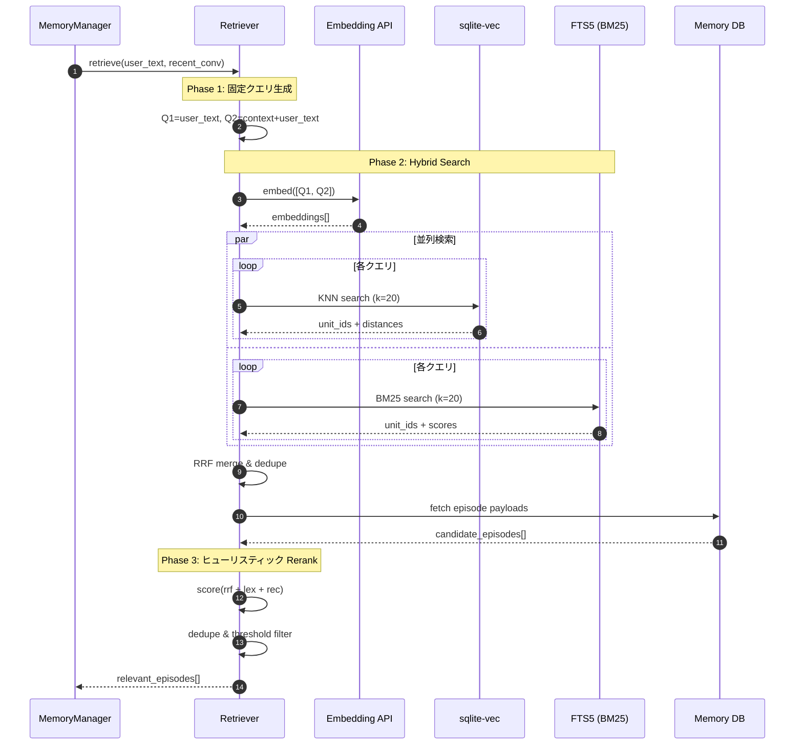

# 記憶検索（Retrieval）設計書

## 概要

cocoro_ghost における記憶呼び出しシステム。会話に関連する過去のエピソードを高速に検索・選別し、MemoryPack に注入する。

**特徴**:
- **LLMレス**: Query Expansion / Reranking に LLM を使わず、高速に動作
- **Hybrid Search**: Vector（意味的類似）+ BM25（キーワード一致）の併用
- **ヒューリスティック Rerank**: 軽量スコアリングで関連度を判定

## 処理フロー

```
ユーザー発話
    │
    ▼
┌─────────────────────────────────────────────────────┐
│ Phase 1: 固定クエリ生成（LLMレス）                    │
│                                                     │
│  入力: user_text + recent_conversation              │
│  処理: 固定2本のクエリを生成（展開なし）               │
│  出力: queries[] = [user_text, context+user_text]   │
└─────────────────────────────────────────────────────┘
    │
    ▼
┌─────────────────────────────────────────────────────┐
│ Phase 2: Hybrid Search (Vector + BM25)              │
│                                                     │
│  入力: queries[]                                    │
│  処理: 各クエリで KNN + BM25 → RRFマージ・重複排除    │
│  出力: candidate_episodes[] (最大60件)              │
└─────────────────────────────────────────────────────┘
    │
    ▼
┌─────────────────────────────────────────────────────┐
│ Phase 3: ヒューリスティック Rerank（LLMレス）         │
│                                                     │
│  入力: user_text + context + candidates             │
│  処理: 軽量スコアリング + 閾値判定                   │
│  出力: relevant_episodes[] (0-5件)                  │
└─────────────────────────────────────────────────────┘
    │
    ▼
MemoryPack に注入
```

## シーケンス図



## Phase 1: 固定クエリ生成

### 目的

LLM や形態素解析を使わず、固定的なクエリを生成して検索する。

### クエリ構成

| クエリ | 内容 | 目的 |
|--------|------|------|
| `Q1` | `user_text` | 直近文脈に引っ張られない検索 |
| `Q2` | `context + "---" + user_text` | 会話の連続性を考慮した検索 |

```python
context = _format_recent_conversation(recent_conversation, max_messages=6)
if context:
    original_query = f"{context}\n---\n{user_text}"
else:
    original_query = user_text

all_queries = [user_text, original_query]  # 重複時は1本
```

### 設計判断

| 判断事項 | 決定 | 理由 |
|----------|------|------|
| Query Expansion | 廃止 | LLM/形態素解析依存を排除、速度優先 |
| クエリ本数 | 固定2本 | シンプルで高速、十分な網羅性 |
| 文脈の範囲 | 直近3往復（6メッセージ） | 長すぎるとノイズ、短すぎると文脈喪失 |

## Phase 2: Hybrid Search (Vector + BM25)

### 目的

意味的類似（Vector）とキーワード一致（BM25）を組み合わせて、関連するエピソードを広く収集する。

### なぜ Hybrid Search か

| 検索方式 | 得意 | 苦手 |
|----------|------|------|
| **Vector (KNN)** | 意味的類似、言い換え | 固有名詞、新語、正確なキーワード |
| **BM25** | 固有名詞、キーワード一致 | 意味的類似、言い換え |

### 検索パラメータ

| パラメータ | 値 | 説明 |
|-----------|-----|------|
| `k` (Vector) | 20 | 各クエリあたりのKNN取得件数 |
| `k` (BM25) | 20 | 各クエリあたりのBM25取得件数 |
| `kind` | EPISODE | 検索対象の Unit 種別 |
| `max_sensitivity` | PRIVATE | 検索対象の最大感度 |
| `occurred_day_range` | 過去365日 | 検索対象期間 |

### BM25 インデックス（FTS5）

```sql
CREATE VIRTUAL TABLE IF NOT EXISTS episode_fts USING fts5(
    user_text,
    reply_text,
    content='payload_episode',
    content_rowid='unit_id',
    tokenize='unicode61'
);
```

### RRF マージ（Reciprocal Rank Fusion）

複数の検索結果を公平に統合する手法。

```python
def _rrf_merge(vector_results, bm25_results, *, max_candidates, rrf_k=60):
    scores: dict[int, float] = defaultdict(float)

    for result_list in vector_results:
        for rank, unit_id in enumerate(result_list):
            scores[unit_id] += 1.0 / (rrf_k + rank + 1)

    for result_list in bm25_results:
        for rank, unit_id in enumerate(result_list):
            scores[unit_id] += 1.0 / (rrf_k + rank + 1)

    sorted_items = sorted(scores.items(), key=lambda x: x[1], reverse=True)
    return sorted_items[:max_candidates]
```

### 設計判断

| 判断事項 | 決定 | 理由 |
|----------|------|------|
| 文脈の含め方 | クエリ先頭に付加 | 埋め込みモデルが文脈を考慮できる |
| 期間制限 | 365日 | 古すぎる記憶は関連度が低い傾向 |
| マージ戦略 | RRF | 異なるスコア体系を公平に統合 |
| BM25 tokenizer | unicode61 | 最低限の既定 |

## Phase 3: ヒューリスティック Rerank

### 目的

LLM を使わず、軽量なスコアリングで候補を並べ替え、関連度の高いエピソードのみを選別する。

### スコア構成

```
final = 0.55 * rrf_norm + 0.35 * lex + 0.10 * rec
```

| 記号 | 意味 | 計算方法 | 重み |
|------|------|----------|------|
| `rrf_norm` | RRF正規化スコア | `score / max_score` | 0.55 |
| `lex` | 文字n-gram類似度 | Dice係数 × 短文補正 | 0.35 |
| `rec` | recency | `exp(-age_days / tau)` | 0.10 |

### 文字n-gram類似度（日本語対応）

分かち書き不要で安定する、文字単位の3-gramを使用。

```python
def _char_ngrams(text, *, n=3, max_chars=1200, tail=False):
    t = _clip_text(text, max_chars=max_chars, tail=tail)
    if not t or len(t) <= n:
        return {t} if t else set()
    return {t[i:i+n] for i in range(len(t) - n + 1)}

def _dice(a: set, b: set) -> float:
    if not a or not b:
        return 0.0
    return 2.0 * len(a & b) / (len(a) + len(b))
```

短文（挨拶等）で偶然一致しやすい問題を避けるための補正:

```python
strength = min(1.0, len(query_ngrams) / 30)
lex = dice(query_ngrams, episode_ngrams) * strength
```

### recency スコア

最近のエピソードを少し優遇する指数減衰関数。

```python
age_days = (now_ts - occurred_at) / 86400
rec = exp(-age_days / tau_days)  # tau_days = 45
```

### 重複抑制（dedupe）

同じようなエピソードが複数選ばれるのを防ぐ。

```python
# 選択済みとの類似度が閾値以上ならスキップ
if _dice(episode_ngrams, selected_ngrams) >= 0.90:
    continue  # skip
```

### 注入判定（閾値）

無関係なエピソードの注入を強く抑制する。

| 変数 | 値 | 意図 |
|------|-----|------|
| `high_threshold` | 0.35 | 1件注入の最低ライン |
| `medium_threshold` | 0.28 | 2件目以降の採用ライン |

判定ロジック:
- `final >= high_threshold` のものが1つでもあれば注入対象
- top1 は `high`、残りは `medium`（ただし `final >= medium_threshold` のみ）
- top1 が `high_threshold` 未満なら `[]` を返す（注入しない）

### reason 生成

LLM由来の自然文は無いので、機械的な形式:

```python
reason = f"heuristic rerank: score={final:.3f} rrf={rrf_norm:.3f} lex={lex:.3f} rec={rec:.3f}"
```

### injection_strategy

`quote_key_parts` 固定（注入量を最小化して速度優先）。

## 統合: MemoryPack への注入

### EPISODE_EVIDENCE セクション

```
[EPISODE_EVIDENCE]
以下は現在の会話に関連する過去のやりとりです。

[2024-12-01] プロジェクトXの進捗について
User: 「今週中に完成させたい」
Partner: 「締切は金曜日でしたね。サポートしますよ」
→ 関連: heuristic rerank: score=0.42 ...
```

### 注入判断（MemoryPack Builder 側）

```python
def should_inject_episodes(relevant_episodes: list[RankedEpisode]) -> bool:
    if not relevant_episodes:
        return False

    # high が1件以上あれば注入
    high_count = sum(1 for e in relevant_episodes if e.relevance == "high")
    if high_count >= 1:
        return True

    # medium が2件以上あれば注入
    medium_count = sum(1 for e in relevant_episodes if e.relevance == "medium")
    if medium_count >= 2:
        return True

    return False
```

## データ構造

### RankedEpisode

```python
@dataclass(frozen=True)
class RankedEpisode:
    unit_id: int
    user_text: str
    reply_text: str
    occurred_at: int
    relevance: Literal["high", "medium"]
    reason: str
```

### CandidateEpisode

```python
@dataclass(frozen=True)
class CandidateEpisode:
    unit_id: int
    user_text: str
    reply_text: str
    occurred_at: int
    rrf_score: float
```

### Retriever クラス

```python
class Retriever:
    """Hybrid Search → Heuristic Rerank の2段階検索。"""

    def __init__(self, llm_client: LlmClient, db: Session):
        self.llm_client = llm_client
        self.db = db
        self._last_injection_strategy = "quote_key_parts"

    @property
    def last_injection_strategy(self) -> str:
        return self._last_injection_strategy

    def retrieve(
        self,
        user_text: str,
        recent_conversation: Sequence[Message],
        *,
        max_candidates: int = 60,
        max_results: int = 5,
    ) -> list[RankedEpisode]:
        candidates = self._search_candidates(user_text, recent_conversation, max_candidates)
        ranked = self._rerank(user_text, recent_conversation, candidates, max_results)
        return ranked
```

## 設定パラメータ

```python
# 検索パラメータ
_RECENT_CONVERSATION_TURNS = 3      # 直近会話ターン数
_KNN_K_PER_QUERY = 20               # Vector検索1クエリあたり
_BM25_K_PER_QUERY = 20              # BM25検索1クエリあたり
_MAX_SENSITIVITY = PRIVATE          # 検索対象の最大sensitivity
_OCCURRED_DAY_RANGE = 365           # 検索対象期間（日）
_RRF_K = 60                         # RRFマージパラメータ

# Rerank パラメータ
_RERANK_NGRAM_N = 3                 # 文字n-gram長
_RERANK_QUERY_MAX_CHARS = 1200      # クエリ正規化上限
_RERANK_EPISODE_MAX_CHARS = 1200    # エピソード正規化上限
_RERANK_RECENCY_TAU_DAYS = 45.0     # Recency減衰定数（日）
_RERANK_DUP_THRESHOLD = 0.90        # 重複判定閾値
_RERANK_HIGH_THRESHOLD = 0.35       # 高関連度閾値
_RERANK_MEDIUM_THRESHOLD = 0.28     # 中関連度閾値
_RERANK_W_RRF = 0.55                # RRFスコア重み
_RERANK_W_LEX = 0.35                # 文字n-gram類似度重み
_RERANK_W_REC = 0.10                # Recency重み
```

## チューニング指針

運用ログから見るべき指標:
- `final/lex/rrf/rec` の分布
- 注入件数（0/1/2/5の割合）
- 返信の体感速度

調整指針:
- 無関係注入が多い → `high_threshold` を上げる、`strength` を強める
- 想起が弱い → `lex` の重みを上げる、`k` を調整
- 最近の話が出ない → `rec` の重み / `tau` を調整

## 導入履歴

- **Intent 分類の廃止**: 従来の `classify_intent()` / `IntentResult` を撤去し、常時検索に移行
- **LLMレス化**: Query Expansion / LLM Reranking を廃止し、ヒューリスティックに置換
- **高速化効果**: Rerank LLM (~10秒) + Expansion LLM (~4秒) → 0ms
