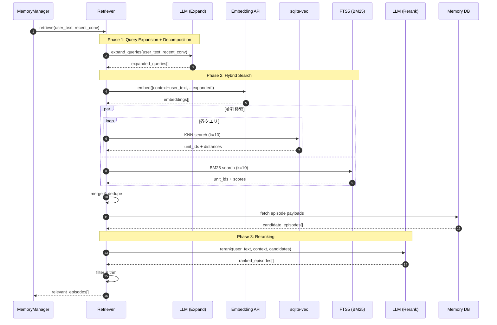

# Contextual Memory Retrieval 設計書

## 概要

本設計は、cocoro_ghost における記憶呼び出しの「自然さ」と「正確性」を根本的に改善するためのものである。
従来の Intent 分類ベースのアプローチを廃止し、**常時・文脈考慮型の記憶検索**に移行する。

## 背景と課題

### 従来方式の問題点

| 問題 | 詳細 |
|------|------|
| **明示的キーワード依存** | 「覚えて」「思い出」等のキーワードがないとエピソード検索が発動しない |
| **暗黙の参照を見逃す** | 「あれどうなった？」のような指示語を解決できない |
| **会話の流れを無視** | 直前の話題との連続性を考慮しない |
| **意味的類似 ≠ 文脈的関連** | 埋め込み類似度だけでは「今日は疲れた」→「先週も疲れてたね」を発見できない |

### 目標

1. **暗黙の参照を解決**: 「あれ」「それ」「この前の」を正確に展開
2. **会話の流れを考慮**: 直近の会話から文脈を汲み取る
3. **意味的関連を発見**: 表面的な類似度を超えた関連記憶の発見
4. **過不足ない注入**: 関連度の高い記憶のみを選択的に注入

## アーキテクチャ

### 処理フロー

```
ユーザー発話
    │
    ▼
┌─────────────────────────────────────────────────────┐
│ Phase 1: Query Expansion + Decomposition            │
│                                                     │
│  入力: user_text + recent_conversation              │
│  処理: LLM が暗黙の参照を展開 + 複合クエリを分解       │
│  出力: expanded_queries[]                           │
│        例: ["プロジェクトXの進捗", "締切日", "担当者"] │
└─────────────────────────────────────────────────────┘
    │
    ▼
┌─────────────────────────────────────────────────────┐
│ Phase 2: Hybrid Search (Vector + BM25)              │
│                                                     │
│  入力: original_query (文脈込み) + expanded_queries  │
│  処理: 各クエリで KNN + BM25 → マージ・重複排除        │
│  出力: candidate_episodes[] (20-40件)               │
└─────────────────────────────────────────────────────┘
    │
    ▼
┌─────────────────────────────────────────────────────┐
│ Phase 3: LLM Reranking                              │
│                                                     │
│  入力: user_text + context + candidates             │
│  処理: LLM関連度判定 + 上位選択                      │
│  出力: relevant_episodes[] (3-5件)                  │
└─────────────────────────────────────────────────────┘
    │
    ▼
MemoryPack に注入
```

> 高速化メモ: LLM呼び出し（Phase 1/3）がレイテンシ支配になる場合、LLMレスのFast Path（RRF + 軽量スコアリング）に置換する計画を `docs/retrieval_fastpath.md` にまとめた。

### シーケンス図



## Phase 1: Query Expansion + Decomposition

### 目的

1. ユーザー発話に含まれる**暗黙の参照**（指示語、省略、文脈依存表現）を明示的なクエリに展開する
2. **複合クエリを分解**して、それぞれ独立した検索クエリに変換する

### 入力

| パラメータ | 型 | 説明 |
|-----------|-----|------|
| `user_text` | string | 現在のユーザー発話 |
| `recent_conversation` | list[Message] | 直近N往復の会話履歴（推奨: 3-5往復） |

### 出力

```json
{
  "expanded_queries": [
    "プロジェクトXの進捗状況",
    "プロジェクトXの締切日",
    "プロジェクトXの担当者"
  ],
  "detected_references": [
    {"type": "anaphora", "surface": "あれ", "resolved": "プロジェクトX"},
    {"type": "temporal", "surface": "この前", "resolved": "先週"}
  ]
}
```

### LLMプロンプト

```
あなたは会話分析の専門家です。
ユーザーの発話と直近の会話履歴から、記憶検索に必要なクエリを生成してください。

## 入力
- ユーザー発話: {user_text}
- 直近の会話:
{recent_conversation}

## タスク
1. 発話に含まれる指示語（あれ、それ、この前、など）を特定し、具体的な内容に解決する
2. 発話が複数の質問や話題を含む場合は、それぞれを独立したクエリに分解する
3. 発話が暗黙に前提としている話題を列挙する

## 出力（JSON）
{
  "expanded_queries": ["検索クエリ1", "検索クエリ2", ...],
  "detected_references": [
    {"type": "anaphora|temporal|ellipsis|topic", "surface": "表層形", "resolved": "解決後"}
  ]
}

## ルール
- expanded_queries は最大5件
- 明確に特定できないものは含めない
- ユーザー発話そのものは expanded_queries に含めない（別途処理する）
- 複合クエリの分解例:
  - 「進捗と締切教えて」→ ["進捗状況", "締切日"]
  - 「あれどうなった？あと担当者は？」→ ["プロジェクトXの状況", "プロジェクトXの担当者"]
- 出力は必ずJSON形式（前後に説明文を付けない）
```

### 設計判断

| 判断事項 | 決定 | 理由 |
|----------|------|------|
| recent_conversation の範囲 | 直近3-5往復 | 長すぎるとノイズ増加、短すぎると文脈喪失 |
| expanded_queries の上限 | 5件 | 検索コストとのバランス |
| LLMモデル | 軽量モデル可 | クエリ生成は複雑な推論不要 |
| CoT分解の統合 | プロンプトに含める | 追加LLM呼び出しを回避 |

## Phase 2: Hybrid Search (Vector + BM25)

### 目的

文脈を考慮した埋め込み検索（Vector）と、キーワードベースの検索（BM25）を組み合わせて、関連する過去のエピソードを広く収集する。

### なぜ Hybrid Search か

| 検索方式 | 得意 | 苦手 |
|----------|------|------|
| **Vector (KNN)** | 意味的類似、言い換え | 固有名詞、新語、正確なキーワード |
| **BM25** | 固有名詞、キーワード一致 | 意味的類似、言い換え |

例: 「プロジェクトX」という固有名詞は、Vector検索では見逃す可能性があるが、BM25なら正確にヒットする。

### クエリ構築

```python
# 文脈込みのオリジナルクエリ
context = format_recent_conversation(recent_conversation[-6:])  # 直近3往復
original_query = f"{context}\n---\n{user_text}"

# 検索クエリリスト
all_queries = [original_query] + expanded_queries
```

### 検索パラメータ

| パラメータ | Vector (KNN) | BM25 |
|-----------|--------------|------|
| `k` (per query) | 10 | 10 |
| `kind` | EPISODE | EPISODE |
| `max_sensitivity` | PRIVATE | PRIVATE |
| `occurred_day_range` | 過去365日 | 過去365日 |

### BM25 インデックス（FTS5）

```sql
-- payload_episode に対する FTS5 仮想テーブル
CREATE VIRTUAL TABLE IF NOT EXISTS episode_fts USING fts5(
    user_text,
    reply_text,
    content='payload_episode',
    content_rowid='unit_id',
    tokenize='unicode61'
);

-- 検索クエリ例
SELECT unit_id, bm25(episode_fts) as score
FROM episode_fts
WHERE episode_fts MATCH :query
ORDER BY score
LIMIT :k;
```

> 注意: `content='payload_episode'` の external content FTS は、`payload_episode` の INSERT/UPDATE/DELETE に追従するトリガー（または再構築手順）が必要。

### 検索の並列実行

```python
def search_hybrid(
    queries: list[str],
    llm_client: LlmClient,
    session_factory: Callable[[], Session],
    k_per_query: int = 10,
) -> list[Candidate]:
    """Vector + BM25 の並列検索

    注意: SQLAlchemy Session はスレッドセーフではない。
    並列検索ではスレッドごとに Session を作る。
    """

    # Vector 検索用の埋め込み生成
    embeddings = llm_client.generate_embedding(queries)

    def _search_vector_all() -> list[list[KnnResult]]:
        db = session_factory()
        try:
            return search_vector_all(db, embeddings, k_per_query)
        finally:
            db.close()

    def _search_bm25_all() -> list[list[BM25Result]]:
        db = session_factory()
        try:
            return search_bm25_all(db, queries, k_per_query)
        finally:
            db.close()

    with ThreadPoolExecutor(max_workers=2) as executor:
        # Vector 検索（並列）
        vector_future = executor.submit(_search_vector_all)
        # BM25 検索（並列）
        bm25_future = executor.submit(_search_bm25_all)

        vector_results = vector_future.result()
        bm25_results = bm25_future.result()

    # マージ
    return merge_candidates(vector_results, bm25_results)
```

### 重複排除とマージ（Reciprocal Rank Fusion）

```python
def merge_candidates(
    vector_results: list[list[KnnResult]],
    bm25_results: list[list[BM25Result]],
    k: int = 60,
    rrf_k: int = 60,
) -> list[Candidate]:
    """
    Reciprocal Rank Fusion (RRF) で複数検索結果をマージする。
    RRF score = Σ 1 / (rrf_k + rank)
    """
    scores: dict[int, float] = defaultdict(float)

    # Vector 結果のスコア計算
    for result_list in vector_results:
        for rank, r in enumerate(result_list):
            scores[r.unit_id] += 1.0 / (rrf_k + rank + 1)

    # BM25 結果のスコア計算
    for result_list in bm25_results:
        for rank, r in enumerate(result_list):
            scores[r.unit_id] += 1.0 / (rrf_k + rank + 1)

    # スコア降順でソート
    sorted_items = sorted(scores.items(), key=lambda x: x[1], reverse=True)
    return [Candidate(unit_id=uid, rrf_score=score) for uid, score in sorted_items[:k]]
```

### 設計判断

| 判断事項 | 決定 | 理由 |
|----------|------|------|
| 文脈の含め方 | クエリ先頭に付加 | 埋め込みモデルが文脈を考慮できる |
| 期間制限 | 365日 | 古すぎる記憶は関連度が低い傾向 |
| マージ戦略 | RRF (Reciprocal Rank Fusion) | 異なるスコア体系を公平に統合 |
| BM25 tokenizer | unicode61 | 最低限の既定（日本語は必要に応じて分かち書き/トライグラム等で調整） |

## Phase 3: LLM Reranking

### 目的

1. Hybrid Search で収集した候補から、現在の会話に**真に関連する**エピソードのみを選別する
2. 注入コストを抑えつつ必要な情報が伝わるよう、注入戦略（injection_strategy）を選択する

### 入力

| パラメータ | 型 | 説明 |
|-----------|-----|------|
| `user_text` | string | 現在のユーザー発話 |
| `context` | string | 直近の会話（フォーマット済み） |
| `candidates` | list[Episode] | Phase 2 で取得した候補（20-40件） |

### 出力

```json
{
  "relevant_episodes": [
    {
      "unit_id": 12345,
      "relevance": "high",
      "reason": "ユーザーが言及している「プロジェクト」の過去の進捗報告"
    },
    {
      "unit_id": 12340,
      "relevance": "medium",
      "reason": "関連する締切の話題"
    }
  ],
  "injection_strategy": "quote_key_parts"
}
```

### LLMプロンプト

```
あなたは会話アシスタントの記憶管理システムです。
過去のエピソード候補から、現在の会話に関連するものを選別してください。

## 現在の会話
ユーザー: {user_text}

## 直近の会話文脈
{context}

## 候補エピソード
{candidates_formatted}

## タスク
各候補について、現在の会話への関連度を判定してください。

## 判定基準
- **high**: 現在の話題に直接関係する。言及すべき情報を含む。
- **medium**: 関連はあるが、言及は任意。背景情報として有用。
- **low**: 関連が薄い、または現在の文脈では不要。
- **none**: 無関係。選択しない。

## 出力（JSON）
{
  "relevant_episodes": [
    {"unit_id": 数値, "relevance": "high|medium", "reason": "選択理由（簡潔に）"}
  ],
  "injection_strategy": "quote_key_parts|summarize|full"
}

## ルール
- relevance が high または medium のもののみ出力
- 最大5件まで（high を優先）
- `unit_id` は候補エピソードに含まれるもののみ（候補外のIDは出力しない）
- 古いエピソードでも関連度が高ければ選択可
- reason は1文で簡潔に
- 出力は必ずJSON形式
```

### 注入戦略（injection_strategy）

| 戦略 | 説明 | 使用ケース |
|------|------|-----------|
| `quote_key_parts` | 重要部分を引用形式で注入 | 具体的な事実確認が必要な場合 |
| `summarize` | 要約して注入 | 複数エピソードを統合する場合 |
| `full` | 全文を注入 | 詳細な文脈が必要な場合（稀） |

### 設計判断

| 判断事項 | 決定 | 理由 |
|----------|------|------|
| 最大選択数 | 5件 | トークン予算とのバランス |
| relevance閾値 | medium以上 | low は注入しても効果薄い |
| LLMモデル | 標準モデル推奨 | 関連度判定は文脈理解が重要 |

## 統合: MemoryPack への注入

### 新しい EPISODE_EVIDENCE セクション

従来:
```
[EPISODE_EVIDENCE]
- 2024-12-01 "ユーザー発話" / "パートナー返答"
```

新方式:
```
[EPISODE_EVIDENCE]
以下は現在の会話に関連する過去のやりとりです。

[2024-12-01] プロジェクトXの進捗について
User: 「今週中に完成させたい」
Partner: 「締切は金曜日でしたね。サポートしますよ」
→ 関連: ユーザーが言及している締切の元となる会話

[2024-11-28] 疲労について
User: 「最近疲れが取れない」
Partner: 「睡眠時間が短いと言っていましたね」
→ 関連: 体調に関する過去の言及
```

### 注入判断のフロー

```python
def should_inject_episodes(relevant_episodes: list[RankedEpisode]) -> bool:
    """
    エピソードを注入すべきかどうかを判断する。
    """
    if not relevant_episodes:
        return False

    # high が1件以上あれば注入
    high_count = sum(1 for e in relevant_episodes if e.relevance == "high")
    if high_count >= 1:
        return True

    # medium が2件以上あれば注入（複数の弱い関連 = 注入価値あり）
    medium_count = sum(1 for e in relevant_episodes if e.relevance == "medium")
    if medium_count >= 2:
        return True

    return False
```

## 廃止対象

本設計の導入により、以下を廃止する:

### コード

| ファイル | 対象 | 理由 |
|----------|------|------|
| `scheduler.py` | `IntentResult` | 不要 |
| `scheduler.py` | `classify_intent_rule_based()` | 不要 |
| `scheduler.py` | `classify_intent()` | 不要 |
| `scheduler.py` | `_parse_intent_json()` | 不要 |
| `prompts.py` | `INTENT_CLASSIFY_SYSTEM_PROMPT` | 不要 |
| `prompts.py` | `get_intent_classify_prompt()` | 不要 |

### build_memory_pack の引数変更

```python
# Before
def build_memory_pack(
    ...
    intent: IntentResult,  # 削除
) -> str:

# After
def build_memory_pack(
    ...
    relevant_episodes: list[RankedEpisode],  # 新規
) -> str:
```

## 新規追加

### ファイル構成

```
cocoro_ghost/
├── retriever.py          # 新規: Retriever クラス
├── scheduler.py          # 変更: Intent 関連を削除
├── prompts.py            # 変更: 新プロンプト追加
└── schemas.py            # 変更: 新スキーマ追加
```

### クラス設計

```python
# retriever.py

@dataclass
class ExpandedQuery:
    query: str
    reference_type: str | None  # anaphora, temporal, ellipsis, topic
    original_surface: str | None

@dataclass
class RankedEpisode:
    unit_id: int
    user_text: str
    reply_text: str
    occurred_at: int
    relevance: Literal["high", "medium"]
    reason: str

class Retriever:
    def __init__(self, llm_client: LlmClient, db: Session):
        self.llm_client = llm_client
        self.db = db

    def retrieve(
        self,
        user_text: str,
        recent_conversation: list[Message],
        *,
        max_candidates: int = 30,
        max_results: int = 5,
    ) -> list[RankedEpisode]:
        """
        3段階の記憶検索を実行し、関連エピソードを返す。
        """
        # Phase 1: Query Expansion
        expanded = self._expand_queries(user_text, recent_conversation)

        # Phase 2: Hybrid Search (Vector + BM25)
        candidates = self._search_candidates(
            user_text, recent_conversation, expanded, max_candidates
        )

        # Phase 3: Reranking
        ranked = self._rerank(user_text, recent_conversation, candidates, max_results)

        return ranked
```

## 評価指標

### 定性評価

| 観点 | 評価方法 |
|------|----------|
| 暗黙参照の解決 | 「あれ」「この前」を含む発話で正しい記憶が呼び出されるか |
| 文脈の継続性 | 話題の流れに沿った記憶が選択されるか |
| 過剰注入の回避 | 無関係な記憶が混入していないか |

### 定量評価（将来）

| 指標 | 目標 |
|------|------|
| Precision@5 | 80%以上（上位5件中4件以上が関連） |
| Recall | 重要な記憶の見落としがないこと |
| Latency | 3段階合計で2秒以内（目安） |

## 実装優先順位

| 順序 | タスク | 依存 |
|------|--------|------|
| 1 | `Retriever` クラスの骨格 | なし |
| 2 | Phase 1 (Query Expansion) | 1 |
| 3 | Phase 2 (Hybrid Search: Vector + BM25 + RRF) | 2 |
| 4 | Phase 3 (LLM Reranking) | 3 |
| 5 | `build_memory_pack` の統合 | 4 |
| 6 | Intent 関連コードの削除 | 5 |
| 7 | テスト・チューニング | 6 |

### 導入方針（段階導入しない）

- 初回リリースから Phase 1〜3 を **毎ターン必ず実行**する
- Phase 2 は **vec0（Vector）+ FTS5（BM25）** を常に併用し、RRF で統合する

## 設定パラメータ（将来的に調整可能）

```toml
[retrieval]
# Phase 1
max_expanded_queries = 5
recent_conversation_turns = 3

# Phase 2
knn_k_per_query = 10
bm25_k_per_query = 10
max_candidates = 40
occurred_day_range = 365
rrf_k = 60  # RRF パラメータ

# Phase 3
max_results = 5
relevance_threshold = "medium"  # "high" or "medium"
```

## 補足: MemOS との対比

| 観点 | MemOS | cocoro_ghost (新設計) | 備考 |
|------|-------|----------------------|------|
| クエリ解析 | TaskGoalParser (keys/tags) | Query Expansion + Decomposition | 同等（アプローチ違い） |
| CoT分解 | `_cot_query` (オプション) | プロンプトに統合 | 追加LLM呼び出し不要 |
| 検索方式 | Graph + Vector + BM25 | Vector + BM25 | Graph不要（Unit構造で代替） |
| マージ戦略 | ID重複排除 | RRF (Reciprocal Rank Fusion) | より公平な統合 |
| Reranking | Cosine + 構造重み + LLM | LLM（high/medium + 戦略） | 同等 |
| ストレージ | Neo4j + Qdrant 等 | SQLite + sqlite-vec + FTS5 | ローカル完結 |
| 制御性 | フレームワーク依存 | 完全に自前 | カスタマイズ容易 |

本設計により、MemOS の「自然さ」を cocoro_ghost の「制御性」と両立させる。
